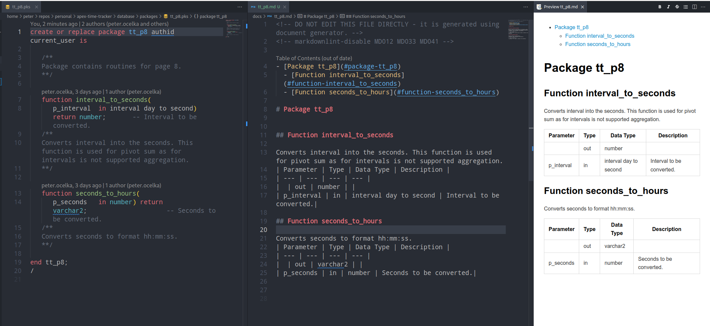

# MS Visual Studio Code Build Tasks

- [MS Visual Studio Code Build Tasks](#ms-visual-studio-code-build-tasks)
  - [Setup](#setup)
    - [Password Manager Setup](#password-manager-setup)
    - [`tasks.json`](#tasksjson)
    - [`run_sql.sh`](#run_sqlsh)
    - [`apex_export.sh`](#apex_exportsh)
    - [`generate_doc.sh`](#generate_docsh)
    - [APEX Export](#apex-export)
    - [Compiling Code](#compiling-code)
    - [Documentation Generation](#documentation-generation)

[Microsoft Visual Studio Code (VSC)](https://code.visualstudio.com/) is a code editor. VSC can compile PL/SQL code directly from VSC (see [this blog](https://ora-00001.blogspot.ca/2017/03/using-vs-code-for-plsql-development.html)) for more information. Opening this project folder in VSC will automatically give you the ability to compile PL/SQL code and do APEX backups

## Setup

Before first task execution few manual changes have to be perfomed for proper functionality.

Modify privileges for helper scripts:

```bash
chmod +x .vscode/scripts/*.sh
chmod +x scripts/*.sh
```

### Password Manager Setup

Storing passwords in plain text is always risky. Personally I don't like to store passwords locally and therefore I'm using [Bitwarden](https://bitwarden.com) as my password manager. Good thing about it is, that you can access your password database using CLI. To setup CLI access you need to perform the following steps:

- Set environment variables (i.e. in your shell profile): `BW_CLIENTID` and `BW_CLIENTSECRET`.
- Login into Bitwarden and unlock database:

    ```bash
    bw login --apikey
    bw unlock --raw
    ```

- `bw unlock` command returns a string which needs to be set into environment variable `BW_SESSION`.
- It might be also good idea to sync database using:

    ```bash
    bw sync
    ```

For more information about CLI, please refer to official documentation.

> If you don't wish to use Bitwarden integration, modify function `get_connection_string` in `./scripts/helper.sh`. Please also modify this section even if you are also using Bitwarden as your setup for passwords might be different.

### `tasks.json`

This file defines the VSCode task. The following changes should be performed:

- Modify `inputs` array and `default` elements. Basically each element in the arraty represents value from Bitwarden entry.
- Modify value for environment variables:

    | Environment Variable | Description                                                                        |
    | -------------------- | ---------------------------------------------------------------------------------- |
    | OCI_WALLET_MAC       | Path where your OCI wallet is located. Keep empty if you are not using OCI wallet. |
    | OCI_WALLET_LINUX     | Path where your OCI wallet is located. Keep empty if you are not using OCI wallet. |
    | SQL_CLI_BINARY       | sqlcl or sqlplus. Full path if binaries are not globally accessible.               |

### `run_sql.sh`

This file is used as a wrapper to execute SQL scripts/commands. You might need to modify section `User specific commands` if you need some specific SQL*Plus pre-setup (i.e. spooling into file).

### `apex_export.sh`

This file is used as a wrapper to export Apex applications. You might need to modify section `User specific commands` if you need some specific SQL*Plus pre-setup.

### `generate_doc.sh`

This file is used to generate documentation from package specification.

### APEX Export

If you want to export your APEX applications execute the `Oracle: Export APEX Application` task. Taks supports export for multiple applications (separated by comma).

### Compiling Code

To compile the current file you're editing execute the `Oracle: Execute SQL` task.

### Documentation Generation

Markdown documentation for PL/SQL packages can be generated by execution of `Oracle: Generate Package Documentation` task. There are already several open source projects available for PL/SQL code documentation generation:

- [PLDoc](http://pldoc.sourceforge.net/)
- [OraDoclet](http://oradoclet.sourceforge.net/)
- [SchemaSpy](http://schemaspy.sourceforge.net/)
- [NaturalDocs](https://www.naturaldocs.org/)
- [PL/SQL to Markdown Documenter](https://github.com/OraOpenSource/plsql-md-doc)
- [PLOC](https://ogobrecht.com/posts/2019-01-10-ploc-plsql-code-to-doc-converter/)

All of these tools require external dependencies and/or special syntax to be followed in order to generate documentation; i.e. JavaDoc practice. Out of the list only `PLOC` is extracting information directly from code, but it still requires external dependency in the form of Node.JS package.

This documentation generation tool, is extracting information directly from database. For documentation I use simple rules:

- Packages instead of standalone procedures and functions.
- Comments should be written directly after the package/function/procedure signature (in the package spec, optionally it should also work for triggers and types, however at this time I have not tested that). Only multiline comments are acceptable in the format `/** comment **/`
  - Multiline comments should contain `<br>` tag, which can be interperted by markdown as new line. It shouldbe also possible to use other markdown conventions like source code template etc.
- Function/Procedure parameters should be described directly after parameters as a comment.
  - Long descriptions can be written in main comment.

**Example:**



> I have tested only generation for one package at a time. However it should also work with prefix specification or sending empty input. I couldn't test all scenarios, as currently my schema contains various packages which are not complaint with the rules specified in this document.
